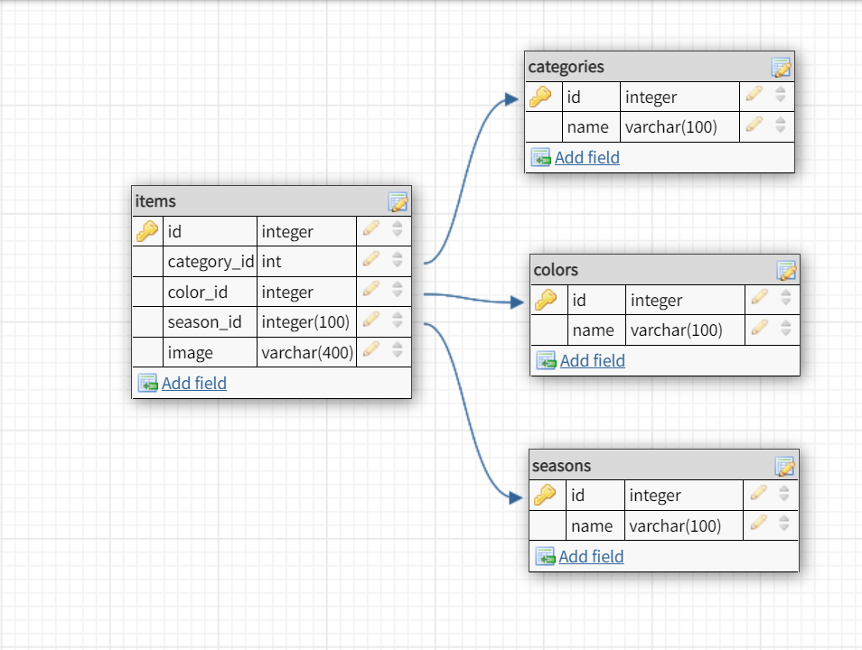

# My Wardrobe App

In this repository you will find My Wardrobe App, built using HTML, CSS, React, Node/Express, and MySQL.

## Setup

### Dependencies

Run `yarn` in the project folder to install dependencies related to Express (the server).

`cd client` and run `yarn` install dependencies related to React (the client).

### Database Prep

Create a `.env` file to the project folder of this repository containing the MySQL authentication information for MySQL user:

```

DB_HOST=localhost
DB_USER=YOUR_USERNAME
DB_NAME=my_wardrobe
DB_PASS=YOUR_PASSWORD

```

(replace `YOUR_USERNAME` and `YOUR_PASSWORD` with your actual username and password)

In the MySQL CLI, type `create database my_wardrobe;` to create a database in MySQL.

- Run `npm run migrate` in the project folder of this repository, in a new terminal window. This will create 4 tables called `categories`, `items`, `colors`, and `seasons` in your database.
- `categories` contains 14 rows
- `colors` contains 12 rows
- `seasons` contains 4 rows
  Check all them in the database to see the structure.
  Thay means that the only table that you have to fill is the `items` table (I added in the proyect folder an image folder that contains the URL's of the images I already used)
  

## Support

Feel free to ask me any doubt :)
